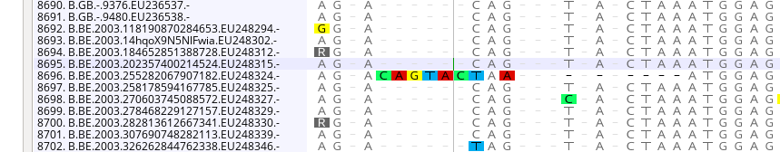
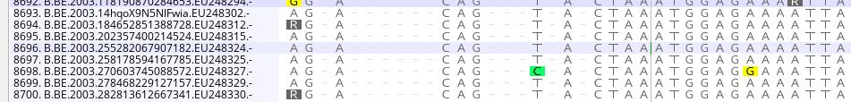
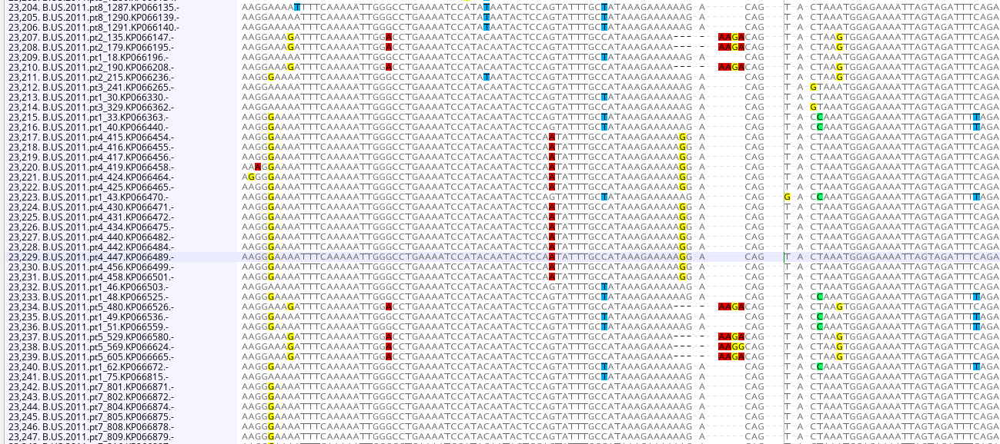
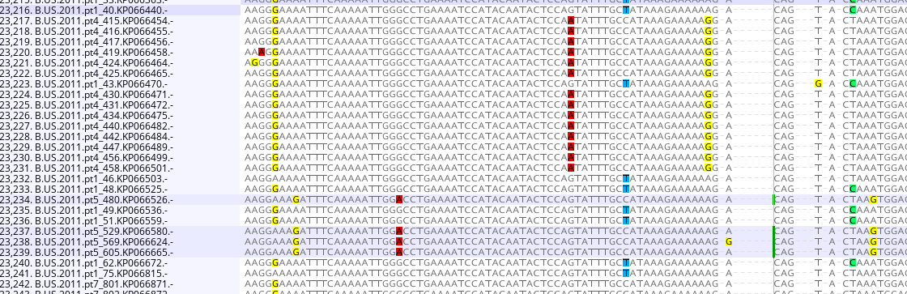
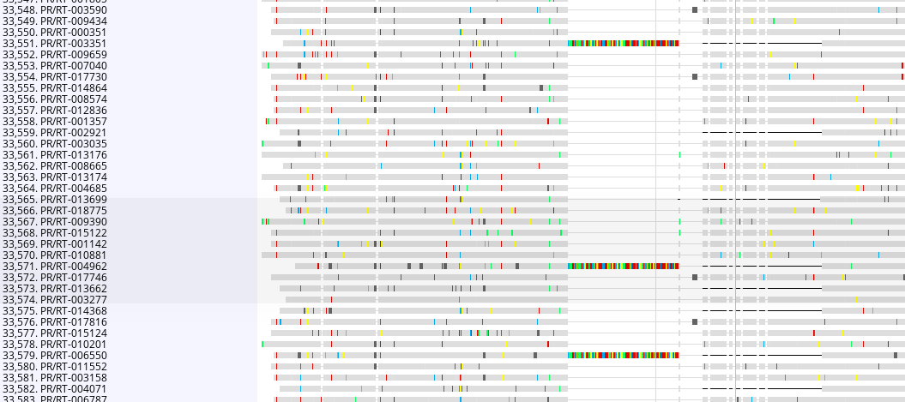
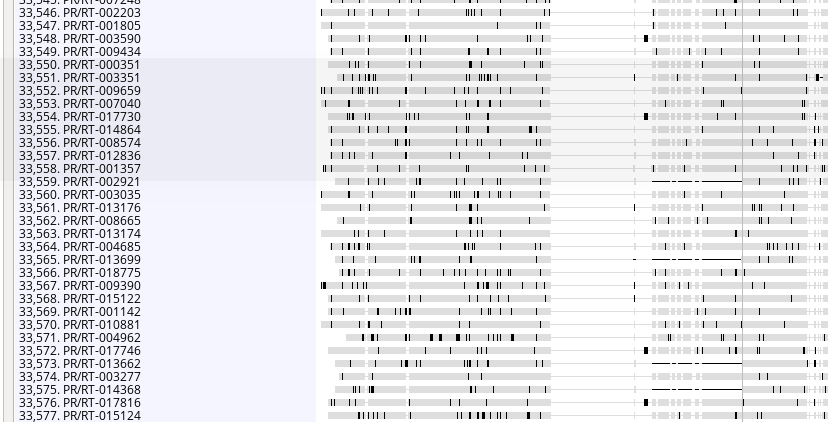

<script>
 function show_hide(ID) {
  var x = document.getElementById(ID);
  if (x.style.display === "none") {
   x.style.display = "block";
  } else {
   x.style.display = "none";
  }
 }
function hide(ID) {
 var x = document.getElementById(ID);
 x.style.display = "none";
}
</script>

```{r, include = FALSE}
options(width = 100)
knitr::opts_chunk$set(echo = TRUE, dev = c('png','pdf'), fig.width= 6, 
                      fig.height=4,
                      collapse = TRUE,
                      comment = "#>"
)
```


```{r, echo=FALSE,eval=TRUE}
Rscript <- readLines(file.path("..","inst","extscript","align_sequences.R"))

begin <- which(Rscript == "#- Begin blast -#") + 1 
end <- which(Rscript == "#- End blast -#") - 1
Blast_Rcsript <- Rscript[begin:end]

begin <- which(Rscript == "#- Begin get_closest_seq -#") + 1 
end <- which(Rscript == "#- End get_closest_seq -#") - 1
get_closest_seq_Rcsript <- Rscript[begin:end]

begin <- which(Rscript == "#- Begin align -#") + 1 
end <- which(Rscript == "#- End align -#") - 1
align_Rcsript <- Rscript[begin:end]

begin <- which(Rscript == "#- Begin postprocess_align_gaps -#") + 1 
end <- which(Rscript == "#- End postprocess_align_gaps -#") - 1
postprocess_align_gaps_Rcsript <- Rscript[begin:end]

begin <- which(Rscript == "#- Begin postprocess_align_identical -#") + 1 
end <- which(Rscript == "#- End postprocess_align_identical -#") - 1
postprocess_align_identical_Rcsript <- Rscript[begin:end]

begin <- which(Rscript == "#- Begin postprocess_align_DRM -#") + 1 
end <- which(Rscript == "#- End postprocess_align_DRM -#") - 1
postprocess_align_DRM_Rcsript <- Rscript[begin:end]

Rscript <- readLines(file.path("..","inst","extscript","build_trees.R"))

begin <- which(Rscript == "#- Begin build_tree -#") + 1 
end <- which(Rscript == "#- End build_tree -#") - 1
build_tree_Rcsript <- Rscript[begin:end]

begin <- which(Rscript == "#- Begin postprocess_tree -#") + 1 
end <- which(Rscript == "#- End postprocess_tree -#") - 1
postprocess_tree_Rcsript <- Rscript[begin:end]

Rscript <- readLines(file.path("..","inst","extscript","Ancestral_state_to_clades.R"))

begin <- which(Rscript == "#- Begin relabelling -#") + 1 
end <- which(Rscript == "#- End relabelling -#") - 1
relabelling_Rcsript <- Rscript[begin:end]

begin <- which(Rscript == "#- Begin phyloscanner -#") + 1 
end <- which(Rscript == "#- End phyloscanner -#") - 1
phyloscanner_Rcsript <- Rscript[begin:end]

begin <- which(Rscript == "#- Begin postprocess_phyloscanner -#") + 1 
end <- which(Rscript == "#- End postprocess_phyloscanner -#") - 1
postprocess_phyloscanner_Rcsript <- Rscript[begin:end]

begin <- which(Rscript == "#- Begin extract_clades -#") + 1 
end <- which(Rscript == "#- End extract_clades -#") - 1
extract_clades_Rcsript <- Rscript[begin:end]
```

# Introduction
<button onclick="show_hide('Introduction')">Show/Hide</button>
<div id="Introduction"> 

### Purpose of the document
In this document, we describe the procedure step by step to construct the transmisson
chains (or transmission clusters) from the viral genomic sequences.
<b>The code showed in this document shall not be run as it stands</b>,
but the scritps to run are introduced with some explanatory comments.

In the following, we present the procedure that we used to study data from 
Public Health Seattle and King County (PHSKC) to analyse the HIV epidemic in King County.
Then, we sometimes refer to the PHSCK data and the PHSCK context because the scripts
are made to be applied in this framework.

### Outline
Below, the following sections address: 

1. Requirements
    * genomic data and meta data
    * an option json file
    * the `phyloHIV` package
2. Background sequences: (required to build the relevant phylogenies)
    * a short description about where to download the background sequences and which criteria to use
    * blast the background sequences against local sequences (and some information about important criteria)
    * add closest sequences to each subtype groups for helping the root estimation
3. Alignment 
    * how to align the sequences 
    * remove the gaps and the drug resistance mutation (DRM)
    * describe how to manually align the sequences when it is necessary 
4. Building phylogenies 
    * how to reconstruct the phylogenies 
    * some postprocess steps 
5. Ancestral state reconstruction and coloring 
    * rerooting and relabelling
    * how to estimate the ancestral states
    * some postprocess steps and plots
6. Transmission chains extraction
    * how to extract the subtress

<button onclick="hide('Introduction')">Hide 'Introduction'</button>
</div>

# Requirements 
<button onclick="show_hide('Requirements')">Show/Hide</button>
<div id="Requirements"> 

For what follows, it is assumed that you are available: 

* local sequences splitted into different files according subtypes, 
* meta data in rds files and 
* LANL sequences for each subtype (without gaps).

Moreover, for the codes described in this document, it is required to set up an option
file, see the example in the package folder `extjson/`.
This folder contains two json files:

* `options.json`: is about input/output paths/names and some required variables
(see below), and
* `internal_options.json`: is about required values that you should not change
sat first. 
    
A detailed description is given with the vignette `phyloHIV_options`.
Nevertheless, you can generate your option json file by using the `write_option_file`
function and/or by contemplating the example option json file: 
    
```{r, echo=TRUE,eval=FALSE,code=readLines("../inst/extjson/options.json",warn=FALSE)}
```

<button onclick="hide('Requirements')">Hide 'Requirements'</button>
</div>

# Background sequences 
<button onclick="show_hide('bg_seq')">Show/Hide</button>
<div id="bg_seq"> 

In order to build phylogenies, we need 1) viral genomic sequences of infected
persons in the population of interest and 2) sequences from external persons who
are likely to have infected persons in the population of interest. 

For the first point "1)", we only have sequences of a part of the infected persons 
in King County (and another document shows how we take this into account while 
modelling phylogenetic subtrees).
For the second point "2)", at first we do not have any evidences about who are likely
to have infected a person living at King County.
We then rely on an online genetic database in order to get the sequences from 
people in the world for which are close to the available sequences from PHSCK
(see below for the detailed steps).

Thus first, we download a bunch of sequences from the Los Alamos National Lab 
website (LANL, https://www.hiv.lanl.gov/components/sequence/HIV/search/search.html).
For each subtype, downloads are limited to sequences that includes the PR/RT
regions. 
In particular, we specify the region with the start (2253) and the end (3253), 
expect for subtype B as we explain in the following. 
We also ask information about persons related to the sequences, as sexe, 
accession number, geographic region and infection year.

Before dealing with these sequences, we preprocess them by removing duplicates and
the gaps (for the illustration of this package, we also reduce the number of
downloaded sequences).
From this bunch of (background) sequences, we expect that only a (small) part is 
related to the SKC epidemic. 
In order to determine the relevant sequences, we use the blast software 
(version 2.7.1+, https://ftp.ncbi.nlm.nih.gov/blast/executables/blast+/2.7.1/)
by 
1) making a blast database for each subtype (with the `makeblastdb` function) and by
2) determining the most similar LANL sequences from the SKC sequences (with the `blastn` function).
```{r, echo=TRUE,eval=FALSE,code=Blast_Rcsript}
```

This code have created for each subtype the following files in `path_LANL_seq` 
directory (path defined in `extjson/options.json`): 

* `.db.nin`: result of `makeblastdb`,
* `.db.nhr`: result of `makeblastdb`,
* `.db.nsq`: result of `makeblastdb` and
* `..._closest.txt`: result of `blastn`.

We finally obtain the closest sequences with the `get_closest_seq` function which
also removes the duplicates (if a background sequence is one of the closest for two or 
more SKC sequences).
Moreover, this function checks if the percent of background sequences in the final 
file (closest background sequences + SKC sequences) is not lower than 70% (or more).
If the percent is lower, it means that the LANL database is too small and/or 
that some closest sequences are the same for a lot of SKC sequences. 
If we keep going with a such final sequences file, we should have difficulty to 
find links between the background epidemic and the SKC epidemic (i.e. some introductions) 
and then we would obtain bigger transmission clusters than we should actually 
estimate.

Thus, if you have a percent lower than 70%, the `get_closest_seq` function starts 
again with a larger number of closest background sequences for each SKC sequences. 

```{r, echo=TRUE,eval=FALSE,code=get_closest_seq_Rcsript}
```

This code have created the following files in the
`path_aligned` directory (path defined in `extjson/options.json`): 

* `..._match.txt`: a file about the closest LANL sequences,
* `..._closest.fasta`: the closest LANL sequences, 
* a file containing the fake sequences and the closest LANL sequences, 
for the example the name should be `newseq_LANL_Subtype_XXX.fasta`, and
* `Closest_result.rda`: an R object, the result of `closest_result` that contains 
for each subtype `closest_result$prop`, the proportion of LANL sequences in `newseq_LANL_Subtype_XXX.fasta`, and `closest_result$nbre_close`, the number of
closest LANL sequences for each fake sequence.

##### A problem with the subtype B 

When we ran the script, we did not obtain a large enough percent for the subtype B.
The last iteration of the `get_closest_seq` function (which selects the 
80 closest background sequences) provided a percent of background sequences about 40%.
Thus, we have aimed to download more B sequences from the LANL website and 
we have used less restrictive criteria. Then, we have downloaded the B sequences 
for which the region (2253 - 2953) is available.

Then, we obtain a percent around 70-75% which is sufficient to work.

<button onclick="hide('bg_seq')">Hide 'Background sequences'</button>
</div>

# Alignment
<button onclick="show_hide('Alignment')">Show/Hide</button>
<div id="Alignment"> 

As we then have closest sequences from the SKC sequences for each subtype, 
the last step before building the phylogenies is to align (and to trim) the sequences.

At this stage, we then have sequences files for each subtype which contains the SKC sequences
and a majority of background sequences.
In order to efficiently estimate the phylogeny root during a next step, 
we add to each sequences file, an outgroup from another subtype. 
Since the genetic distance between two different subtypes is (in general) larger 
than the genetic distance between two sequences of a same subtype, the root of 
the tree should be in the additional subtype group.
Nevertheless, if we add sequences from a very different subtypes, the estimation 
of the phylogeny could be complicated, as aforementioned.
Then, for each subtype we add few sequences from the closest subtype, according 
to [Li et al. (2015)](https://retrovirology.biomedcentral.com/track/pdf/10.1186/s12977-015-0148-6).
Therefore, we should obtain for each subtype a fasta file containing (in this order), 
the closest LANL sequences, the PHSKC sequences and the outgroup. 

With the following code, we add the outgroup at each file, as aforementioned, and
we align the sequences by using 
[MAFFT](https://mafft.cbrc.jp/alignment/software/)
(version 7.4). It is also possible to change an option of the function `align_seq` 
to use the [CodonAlign](http://www.hiv.lanl.gov/content/sequence/CodonAlign/codonalign.html) software.

```{r, echo=TRUE,eval=FALSE,code=align_Rcsript}
```

This code have created for each subtype the following files in the
`path_aligned` directory (path defined in `extjson/options.json`): 

* `..._mafft_aligned.fasta`: the aligned sequences by using MAFFT and
* `outgroup.rda`: an R object that contains the sequence names of 
the outgroups.

If the `align_seq` function is run with MAFFT and if it contains more than 500 
sequences, the algorithm splits the sequence files into small files 
(with `fasta-splitter`). 
In order to align all sequences, the algorithm will 
1) align a first small file and 
2) align the $(i+1)$-th file with respect to the $i$ first aligned small files 
which are merged into one file.

If the `align_seq` function is run with CodonAlign, the algorithm calls a python 
script. I have slightly changed the script in order to specify the name and the 
directory of the output. 
However, the script is quite long to run, maybe because it handles the whole file.
Indeed, I did not find the way to use it as MAFFT, with a piecewise running. 

### Postprocess
<button onclick="show_hide('postprocess_align')">Show/Hide</button>
<div id="postprocess_align"> 
We have the aligned sequences for each subtype: 
The sequences are stored in a matrix, the rows are the different infected persons 
and the columns are the genetic locations.

Before keep going, we need to postprocess the alignment to fix some errors or to remove 
patterns/sequences that could badly impact the phylogeny estimation. 

#### Gap stripping

Firstly, we remove the columns which  mostly contains gaps. This kind of columns 
could be because of an error of the alignment algorithm which for few sequences 
at the same loci

For doing this, we use the `seq.strip.gap` function from the `big.phylo` package
(see the [GitHub](https://github.com/olli0601/big.phylo) link). 
In pratice, we decide to remove gap columns if the columns contains less than 25
non-gaps. 
For subtypes with a large number of sequences, we have use a threshold equals to 
100 instead of 25 (see `Remove more columns` in the).

```{r, echo=TRUE,eval=FALSE,code=postprocess_align_gaps_Rcsript}
```

This code overwrites the `..._mafft_aligned.fasta` sequences in `path_aligned`.

Nevertheless, we have observed that it can still remain some bugs in the alignment
after this corrections, especially for the biggest subtype (C and B). We then 
need to manually fix some alignments bugs with a genome browser 
(see [Geneious](https://www.geneious.com/academic/)).

Below, I show some examples of fixes. 

<b>First case, before:</b> {#id .class height=150px}

<b>First case, after:</b> {#id .class height=100px}

<b>Second case, before:</b> {#id .class height=250px}

<b>Second case, after:</b> {#id .class height=250px}

<b>Third case, before:</b> {#id .class height=250px}

<b>Third case, after:</b> 

{#id .class height=250px}

#### Duplicate sequences
As we have aligned sequences, it is now possible to detect duplicates if some 
sequences are identical with the `find_identical_sequences` function.
Nevertheless, there is a non null probability that two infected persons have the
same viral genome, especially if one have just infected the other one. 
However, even if it the case, we choose to remove identical sequences (just keeping one), 
since we do not have evidences and because it could badly impact the 
phylogeny estimation.

```{r, echo=TRUE,eval=FALSE,code=postprocess_align_identical_Rcsript}
```

This code overwrites the `..._mafft_aligned.fasta` sequences in `path_aligned` 
and save the removed sequence indexes in `indexes_identical.rda`.

#### Drug resistance mutations
Below, we also show how to remove drug resistance mutations that could not be 
relevant to distinguish infected persons in a genomic point of view. 
We use code from the `big.phylo` package, in particular the `seq.rm.drugresistance2`
function that I have slightly changed so that it runs on my laptop. 

```{r, echo=TRUE,eval=FALSE,code=postprocess_align_DRM_Rcsript}
```

This code have created for each subtype the following files in the
`path_aligned` directory (path defined in `extjson/options.json`):

* `..._mafft_aligned_ndrm.fasta`: 

<button onclick="hide('postprocess_align')">Hide 'Postprocess'</button>
</div>

<button onclick="hide('Alignment')">Hide 'Alignment'</button>
</div>

# Building phylogenies
<button onclick="show_hide('phylo')">Show/Hide</button>
<div id="phylo">
From the previous steps, we have obtained for each subtype an aligned sequence file. 
We now use the `building_tree` and we can choose between different algorithm 
to estimate the phylogeny (`fasttree`, `ExaML` or `maximum_parsimony`).
We usually choose fasttree since we had difficulty to install EXaML and because 
the `maximum_parsimony` function provides `NaN` values and then crashed without
any possibility to obtain a result.

```{r, echo=TRUE,eval=FALSE,code=build_tree_Rcsript}
```

This code have created some files in `path_tree`. 
For each subtype, a folder is created which contains the following outputs:

* `..._mafft_aligned_ndrm.newick`: the estimated tree, 
* `..._mafft_aligned_ndrm_ft.XXX.newick`: the bootstrap estimated trees and
* `RAxML...`: some files about the estimation.

The option `bs.n` is the number of bootstrap tree to compute. 
At first, we choosed to compute only few of them in order to quickly obtain the 
results.
We recently increase this number to 500 (and also 1000) in order to obtain more
information about the phylogeny estimate uncertainty.

Finally, we run the following function to remove the external group (additional sequences from
another subtype and the HXB2 sequence). 
Moreover, the tree root is defined as the position of the external group.

```{r, echo=TRUE,eval=FALSE,code=postprocess_tree_Rcsript}
```

This code have created the following files in `path_tree/.../`.

* `..._rerooted.newick`: the same tree which was rerooted and for which 
the outgroup was removed (same for the boostrap trees).

<button onclick="hide('phylo')">Hide 'Building phylogenies'</button>
</div>

# Ancestral state reconstruction (and tree coloring)
<button onclick="show_hide('asr_color')">Show/Hide</button>
<div id="asr_color"> 

From the phylogenetic trees, we can not directly determine clusters of transmission
occuring in SKC since we only know the location of the tips.
In this Section, we present how to estimate the ancestral state (i.e. the location
of each node in this case) with the Sankoff algorithm.

The first step is to relabel the tips according to their groups.
For instance, the persons infected in SKC are in the `SKC` group, the
persons registered in the PHSCK database which are not a `kc_case` are in the 
`WA\KC` group and the tips related to background sequences are in different groups
according to their world region origins (`Europe`, `Asia`, ...).
Below, we give a sketch of the script to use, which is a part of the 
`use_phyloscanneR` script.

```{r, echo=TRUE,eval=FALSE,code=relabelling_Rcsript}
```

This code have created the following files in `path_tree/.../`.

* `..._renamed.newick`: the same tree which was rerooted and for which 
the outgroup was removed (same for the boostrap trees).

If you are interested about a specific group (as for example the heterosexual persons, `HSX`)
you can define a subgroups: 

* heterosexuals from SKC (`KCHSX`)
* non-heterosexuals from SKC (`KCnonHSX`)

It is then required to add the next lines to the `extjson/options.json` file.
```{r, echo=TRUE, eval=FALSE}
 "focus_subgroup": ["HSX_F","HSX_M"], # the categories to focus
 "index_subgroup": 7, # in which spot is this information in the tip labels
 "name_subgroup": "HSX" # the name of the subgroup that will be use to relabel the tips
```

We are now able to use a `phyloscanner` script to estimate the ancestral states.
The following chunk could be long to run and it could be necessary to run it 
on HPC. 

```{r, echo=TRUE,eval=FALSE,code=phyloscanner_Rcsript}
```

And a postprocess step: 
```{r, echo=TRUE,eval=FALSE,code=postprocess_phyloscanner_Rcsript}
```

This code have created the following files in `path_colored_tree/.../` :

* `..._trait.csv` and `..._MRCA.txt`: useful files for the next step.

<button onclick="hide('asr_color')">Hide 'Ancestral state reconstruction and coloring'</button>
</div>

# Transmission chains extraction
<button onclick="show_hide('tc_extract')">Show/Hide</button>
<div id="tc_extract"> 

We show below how to extract SKC transmission clusters from the phylogeny and the 
ancestral state reconstruction. 
In other words, it corresponds to extracting subtrees according to the coloring.
In the following, we give a sketch of the `Clades_extracting` R script to 
extract clusters of one subtype.
Nevertheless, we usually gather the clusters of all the subtypes in a same list.

```{r, echo=TRUE,eval=FALSE,code=extract_clades_Rcsript}
```

This code have created for each bootstrap an RData file, `Clades_save_XXX.RData`
in `path_clades`.

<button onclick="hide('tc_extract')">Hide 'Transmission chains extraction'</button>
</div>
